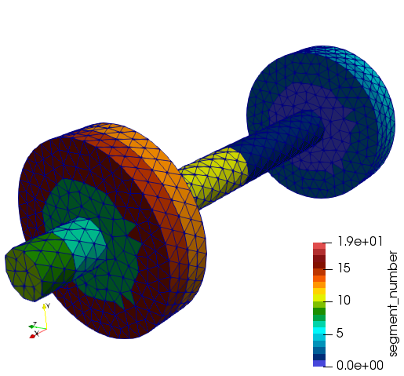
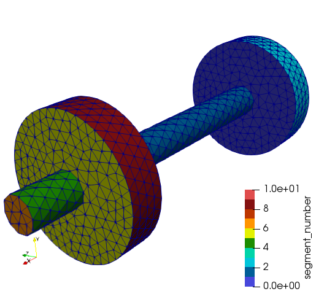

# Surface Segmentation

The task of this project is to partition a boundary mesh (containing solely triangles) into several segments, such that no segment contains a geometric edge of the surface. This segmentation is used as preprocessing tool for other algorithms.

Why have we developed this tool? When solving boundary value problems by means of boundary element methods one encounters fully populated matrices. These matrices are often approximated by hierarchical matrices ($`\mathcal{H}`$-matrices) and the *Adaptive Cross Approximation (ACA)*, see [1]. For this reason the matrix indices and equivalently the boundary mesh is clustered. It has been observed that clusters containing sharp geometric edges influence the approximation algorithms. Therefore, we proposed in [2] to use a *surface segmentation* in a preprocessing step and to apply the clustering afterwards on top of the segmentation.

## Getting Started

These instructions will help you to install the code and they will give you a first hint how to use it.

### Prerequisites

The program is almost self-contained such that the compilation should not cause many difficulties. The only requirement is a library containing the `cblas` interface as, for example, [OpenBLAS](https://www.openblas.net/) or others. If you are using another library you have to adapt the linker flag `LINKOP = -lopenblas -lm` in the [`Makefile`](Makefile).

### Installation

Download and unzip the project. In the main directory you can find a `Makefile`, which should be ready for your use. Maybe you have to adapt the linker flag, see above. Now navigate in your bash  to the folder and compile the code by 
```
make
```

### Starting the Program

The executable is called `SegmentBM`. The only necessary input is a surface mesh in the `msh` format that contains solely triangles. You can run the code, i.e., by
```
./SegmentBM meshes/dumpbell.msh
```
The result is stored in a `msh` and/or `vtk` file which can be visualized by [gmsh](http://gmsh.info/) and [Paraview](https://www.paraview.org/), respectively. For more options run
```
./SegmentBM -h
```

#### Example

We run 
```
./SegmentBM -o dumpbell_1.vtk meshes/dumpbell.msh
```
and the variant with postprocessing
```
./SegmentBM -o dumpbell_2.vtk -p meshes/dumpbell.msh
```
and obtain the following results for `dumpbell_1` and for `dumpbell_2`





### More Details

Here are some more details on the code. The publication [2] makes use of a segmentation algorithm that is split into *Algorithm 2*, *Algorithm 3* and *Algorithm 4* in the referred work. These can be found in the file [PartitionBoundaryMesh.c](PartitionBoundaryMesh.c). Edges in the mesh are detected as geometric edges if the dihedral angle of the neighbouring elements exceeds a threshold parameter. This parameter can be set with the options `-a` and `-t`. Meanwhile, there is also a postprocessing available that reduces the number of segments. It is applied when the program is run with the option `-p`. The code can be found in [Postprocessing.c](Postprocessing.c).

#### Partition Boundary Mesh

In order to perform the surface 
decomposition, each triangle is assigned to a set of elements belonging to the same segment. 
The borders of these segments are formed by edges of triangles. There are two kinds of such borders. 
They are either located aligned with edges of the geometry or between two segments meeting on a flat 
part of the surface. 
The aim of the algorithm is to divide the surface triangulation of the geometry into 
segments such that the edges in the geometry are resolved and each segment consists of a smooth 
part of the surface only. For this reason, we proceed as follows: We seek the geometric edges in the surface, 
follow them and assign the adjacent triangles of each side a number which defines the segment. Afterwards, 
we complete the segments in a uniform way. Consequently, we define the borders of the segments along the edges 
of the geometry explicitly and perform a fully automatic procedure to specify the borders within the smooth part of the surface. For more details we refer to [2].

#### Postprocessing

The number of segments is reduced by unifying neighbouring segments which only share boundaries in the smooth part of the surface. In the example above, we have already seen that
```
./SegmentBM -o dumpbell_2.vtk -p meshes/dumpbell.msh
```
detects 11 segments on the boundary of the dumpbell as expected. In contrast, the algorithm without postprocessing detects 20 segments.


## Authors

* **Sergej Rjasanow**, Department of Mathematics, Saarland University, [web](www.num.uni-sb.de/rjasanow)
* **Steffen Weißer**, Department of Mathematics, Saarland University, [web](www.num.uni-sb.de/weisser)


## Questions / Comments / Contributions

It is our great pleasure that you are interested in our work. If you have any questions or comments, or if you would like to contribute to our project, feel free to open an issue on github or contact us via e-mail.


## License

This project is licensed under the MIT License - see the [LICENSE](LICENSE) file for details


## References

1. S. Rjasanow, O. Steinbach: *The fast solution of boundary integral equations*. Math. Anal. Tech. Appl. Eng., Springer, New York, 2007
2. S. Rjasanow, S. Weißer: *ACA improvement by surface segmentation*, 2018 (submitted)

